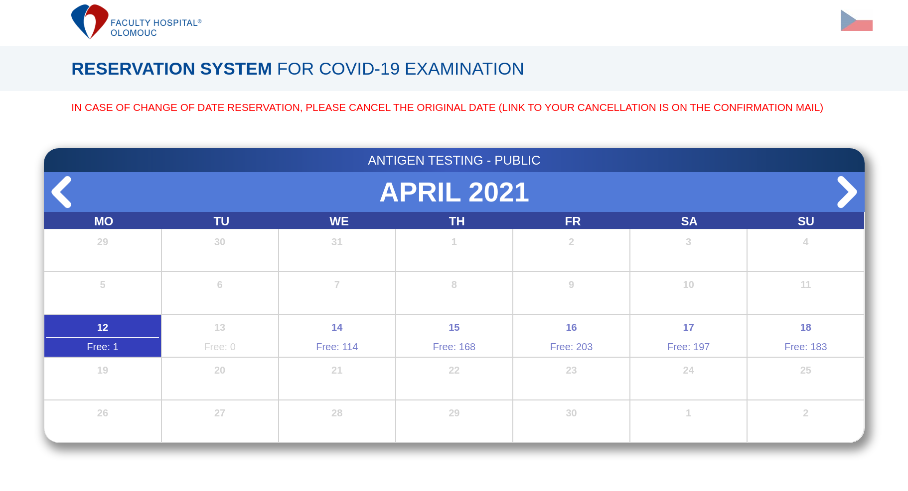

# Covid-19 antigen test reservations @ FNOL

The goal of this project was automatize registration for an antigen testing (paid by your health insurance) at [FNOL in Olomouc](https://www.fnol.cz/) 
within a few days where there was no free capacity. 


The testing capacity was increased recently, therefore most of the time it's possible to successfully register directly on their [Registration site](https://rezervacecovid.fnol.cz/Pages/Calendar2.aspx?calendarType=Public).



But if you are in hurry and need to be tested ASAP (even today), you might still use this code to get the closest testing slot possible. 

## Installation & setup

#### Clone this project

First clone this repo to your device/download as ZIP and extract.
#### Install Python, pip
```shell script
sudo apt install python3
sudo apt install python3-pip
```

#### Install selenium driver

**TLDR:** Downlad [geckodriver](https://github.com/mozilla/geckodriver/releases), extract and copy it to ```/usr/bin``` or ```/usr/local/bin```


Selenium requires a driver to interface with the chosen browser. Firefox (used in this code) requires [geckodriver](https://github.com/mozilla/geckodriver/releases)
, which needs to be installed before the below examples can be run. Make sure it’s in your PATH, e. g., place it in ```/usr/bin``` or ```/usr/local/bin```.

Failure to observe this step will give you an error ```selenium.common.exceptions.WebDriverException: Message: ‘geckodriver’ executable needs to be in PATH.```

For moredetails/Windows instructions follow [instructions here](https://selenium-python.readthedocs.io/installation.html)
 
#### Install requirements 
```shell script
sudo pip3 install -r ./requirements.txt 
```

#### Fill information
First following details in the [main.py](./main.py)
```python
# Looking for a reservation on YYYY-MM-DD (you can add multiple dates, ordered by priority.
# First = the best for you.
searching_for = ["2021-03-14", "2021-03-13", "2021-03-11"]

# Information used for a registration form
firstName = "Name"
lastName = "Surname"
phone = "123123123"
# enter a valid email even for testing purposes to be be able to cancel the reservation created !!!
mail = "email@test.com" 
```


## Run

```shell script
python3 ./main.py 
```

Zero-code is returned in case of success. You will get an email from FNOL with the exact time, date and place. In case you will need to cancel the reservation you will find the cancellation link in the email. 

Non-zero code returned if information filled is incorrect (or something else goes wrong). 

## Possible improvements

- Switch to the other month when selecting month (just call javascript function ```cycleMonth(1) ```). Currently searches only on default-displayed month
